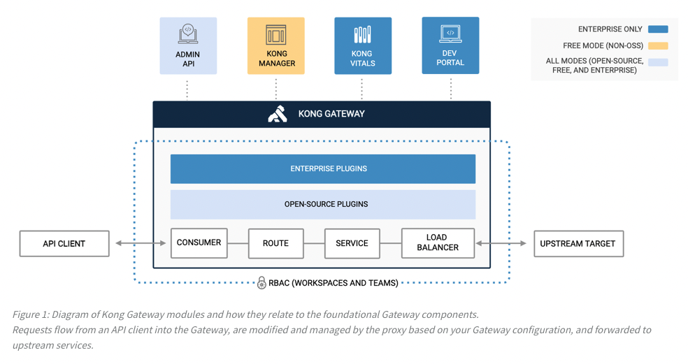
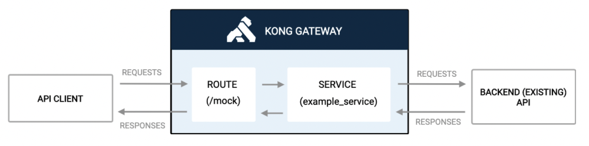
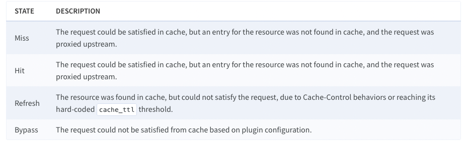

# Overview
We will overview how Kong GateWay work and go into detail about each part of Kong.

Kong Gateway is a lightweight, fast, and flexible cloud-native API gateway. An API gateway is a reverse proxy that lets you manage, configure, and route requests to your APIs.

- Kong Admin API: provides a RESTful interface for administration and configuration of Services, Routes, Plugins, and Consumers. All of the tasks you can perform against the Gateway can be automated using the Kong Admin API.

## Advantage Kong API
- Scale up
- Hight performance
- Plugins
- Free

## ARCHITECTURE


# Details

## Service and Routes

Services and routes are configured in a coordinated manner to define the routing path that requests and responses will take through the system.



### Service:

Services can store collections of objects like plugin configurations, and policies, and they can be associated with routes.

1. Create a services: `curl -i -s -X POST http://localhost:8001/services \
  --data name=example_service \
  --data url='http://mockbin.org'`.

This request instructs Kong Gateway to create a new service mapped to the upstream URL http://mockbin.org.
- `name`: The name of the service
- `url`:  An argument that populates the host, port, and path attributes of the service

If your request was successful:
```
{
  "host": "mockbin.org",
  "name": "example_service",
  "enabled": true,
  "connect_timeout": 60000,
  "read_timeout": 60000,
  "retries": 5,
  "protocol": "http",
  "path": null,
  "port": 80,
  "tags": null,
  "client_certificate": null,
  "tls_verify": null,
  "created_at": 1661346938,
  "updated_at": 1661346938,
  "tls_verify_depth": null,
  "id": "3b2be74e-335b-4f25-9f08-6c41b4720315",
  "write_timeout": 60000,
  "ca_certificates": null
}
```

2. View service configuration: `curl -X GET http://localhost:8001/services/example_service`.
```
{
  "host": "mockbin.org",
  "name": "example_service",
  "enabled": true,
  ...
}
```

3. Updating services: `curl --request PATCH \
  --url localhost:8001/services/example_service \
  --data retries=6`

4. Listing services: `curl -X GET http://localhost:8001/services`

### Routes

A route is a path to a resource within an upstream application. Routes are added to services to allow access to the underlying application. In Kong Gateway, routes typically map to endpoints that are exposed through the Kong Gateway application. Routes can also define rules that match requests to associated services.

You can also configure routes with:
- Protocols: The protocol used to communicate with the upstream application.
- Hosts: Lists of domains that match a route
- Methods: HTTP methods that match a route
- Headers: Lists of values that are expected in the header of a request
- Redirect status codes: HTTPS status codes
- Tags: Optional set of strings to group routes with
  
1. Create routes: `curl -i -X POST http://localhost:8001/services/example_service/routes \
  --data 'paths[]=/mock' \
  --data name=example_route`

```
{
  "paths": [
    "/mock"
  ],
  "methods": null,
  "sources": null,
  "destinations": null,
  "name": "example_route",
  "headers": null,
  "hosts": null,
  "preserve_host": false,
  "regex_priority": 0,
  "snis": null,
  "https_redirect_status_code": 426,
  "tags": null,
  "protocols": [
    "http",
    "https"
  ],
  "path_handling": "v0",
  "id": "52d58293-ae25-4c69-acc8-6dd729718a61",
  "updated_at": 1661345592,
  "service": {
    "id": "c1e98b2b-6e77-476c-82ca-a5f1fb877e07"
  },
  "response_buffering": true,
  "strip_path": true,
  "request_buffering": true,
  "created_at": 1661345592
}
```

2. View route configurations: `curl -X GET http://localhost:8001/services/example_service/routes/example_route`

When you create a route, Kong Gateway assigns it a unique id as shown in the response above. The id field, or the name provided when creating the route, can be used to identify the route in subsequent requests. The route URL can take either of the following forms:

- `/services/{service name or id}/routes/{route name or id}`
- `/routes/{route name or id}`
  
3. Update routes: `curl --request PATCH \
  --url localhost:8001/services/example_service/routes/example_route \
  --data tags="tutorial"`

4. List routes: `curl http://localhost:8001/routes`

### Proxy a request

- Kong is an API Gateway, it takes requests from clients and routes them to the appropriate upstream application based on a the current configuration. Using the service and route that was previously configured, you can now access https://mockbin.org/ using http://localhost:8000/mock.
- By default, Kong Gateway’s Admin API listens for administrative requests on port 8001, this is sometimes referred to as the control plane. Clients use port 8000 to make data requests, and this is often referred to as the data plane.
- Mockbin provides a /requests resource which will echo back to clients information about requests made to it. Proxy a request through Kong Gateway to the /requests resource: `curl -X GET http://localhost:8000/mock/requests`

## Rate Limiting

Rate limiting is used to control the rate of requests sent to an upstream service. It can be used to prevent DoS attacks, limit web scraping, and other forms of overuse. Without rate limiting, clients have unlimited access to your upstream services, which may negatively impact availability.

### Global rate limiting

1. Enable rate limiting: `curl -i -X POST http://localhost:8001/plugins \
  --data name=rate-limiting \
  --data config.minute=5 \
  --data config.policy=local`

- This command has instructed Kong Gateway to impose a maximum of 5 requests per minute per client IP address for all routes and services.
- The policy configuration determines where Kong Gateway retrieves and increments limits. See the full plugin configuration [reference](https://docs.konghq.com/hub/kong-inc/rate-limiting/#configuration) for details.

2. Validate

After configuring rate limiting, you can verify that it was configured correctly and is working, by sending more requests then allowed in the configured time limit.

Run cmd: `for _ in {1..6}; do curl -s -i localhost:8000/mock/request; echo; sleep 1; done`

After the 6th request, you should receive a 429 “API rate limit exceeded” error:

```
{
  "message": "API rate limit exceeded"
}
```

### Service level rate limiting

The Rate Limiting plugin can be enabled for specific services. The request is the same as above, but posted to the service URL: `curl -X POST http://localhost:8001/services/example_service/plugins \
   --data "name=rate-limiting" \
   --data config.minute=5 \
   --data config.policy=local`

### Routes level rate limiting

The Rate Limiting plugin can be enabled for specific routes. The request is the same as above, but posted to the route URL:
`curl -X POST http://localhost:8001/routes/example_route/plugins \
   --data "name=rate-limiting" \
   --data config.minute=5 \
   --data config.policy=local`

## Proxy Caching

- The Proxy Cache plugin accelerates performance by caching responses based on configurable response codes, content types, and request methods.
- When caching is enabled, upstream services are not bogged down with repetitive requests, because Kong Gateway responds on their behalf with cached results

### Cache Time to Live

TTL governs the refresh rate of cached content, which is critical for ensuring that clients aren’t served outdated content. A TTL of 30 seconds means content older than 30 seconds is deemed expired and will be refreshed on subsequent requests. TTL configurations should be set differently based on the type of the content the upstream service is serving.

### Global proxy caching

1. Enable proxy caching

RUN CMD: `curl -i -X POST http://localhost:8001/plugins \
  --data "name=proxy-cache" \
  --data "config.request_method=GET" \
  --data "config.response_code=200" \
  --data "config.content_type=application/json; charset=utf-8" \
  --data "config.cache_ttl=30" \
  --data "config.strategy=memory"`

[See more configuration proxy caching](https://docs.konghq.com/hub/kong-inc/proxy-cache/)

2. Validate

RUN CMD: `curl -i -s -XGET http://localhost:8000/mock/requests | grep X-Cache`

- On the initial request, there should be no cached responses, and the headers will indicate this with X-Cache-Status: Miss. 
```
X-Cache-Key: c9e1d4c8e5fd8209a5969eb3b0e85bc6
X-Cache-Status: Miss
```
- Within 30 seconds of the initial request, repeat the command to send an identical request and the headers will indicate a cache Hit:
```
X-Cache-Key: c9e1d4c8e5fd8209a5969eb3b0e85bc6
X-Cache-Status: Hit
```



### Service level proxy caching

The Proxy Cache plugin can be enabled for specific services. The request is the same as above, but the request is sent to the service URL:

RUN CMD: `curl -X POST http://localhost:8001/services/example_service/plugins \
   --data "name=proxy-cache" \
   --data "config.request_method=GET" \
   --data "config.response_code=200" \
   --data "config.content_type=application/json; charset=utf-8" \
   --data "config.cache_ttl=30" \
   --data "config.strategy=memory"`

### Route level proxy caching

The Proxy Caching plugin can be enabled for specific routes. The request is the same as above, but the request is sent to the route URL:

RUN CMD: `curl -X POST http://localhost:8001/routes/example_route/plugins \
   --data "name=proxy-cache" \
   --data "config.request_method=GET" \
   --data "config.response_code=200" \
   --data "config.content_type=application/json; charset=utf-8" \
   --data "config.cache_ttl=30" \
   --data "config.strategy=memory"`


## Key Authentication

Authentication is the process of verifying that a requester has permissions to access a resource. As it’s name implies, API gateway authentication authenticates the flow of data to and from your upstream services.

### Set up consumers and keys
1. Create a new consumer

RUN CMD: `curl -i -X POST http://localhost:8001/consumers/ \
  --data username=luka`

2. Assign the consumer a key
RUN CMD: `curl -i -X POST http://localhost:8001/consumers/luka/key-auth \
  --data key=top-secret-key`

### Global key authentication
1. Enable key authentication

RUN CMD: `curl -X POST http://localhost:8001/plugins/ \
    --data "name=key-auth"  \
    --data "config.key_names=apikey"`

The `key_names` configuration field in the above request defines the name of the field that the plugin looks for to read the key when authenticating requests.

2. Send an unauthenticated request
- `curl -i http://localhost:8000/mock/request` 

```
HTTP/1.1 401 Unauthorized
...
{
    "message": "No API key found in request"
}
```

- `curl -i http://localhost:8000/mock/request \
  -H 'apikey:bad-key'`

```
HTTP/1.1 401 Unauthorized
...
{
  "message":"Invalid authentication credentials"
}
```

- `curl -i http://localhost:8000/mock/request \
  -H 'apikey:top-secret-key'`
```
You will receive a 200 OK response.
```

### Service based key authentication

RUN CMD: `curl -X POST http://localhost:8001/services/example_service/plugins \
     --data name=key-auth`

### Route based key authentication

RUN CMD: `curl -X POST http://localhost:8001/routes/example_route/plugins \
     --data name=key-auth`

## Disable the plugin

1. Find the Key Authentication plugin ID

RUN CMD: `curl -X GET http://localhost:8001/plugins/`
```
...
"id": "2512e48d9-7by0-674c-84b7-00606792f96b"
...
```

2. Disable the plugin

RUN CMD: `curl -X PATCH http://localhost:8001/plugins/2512e48d9-7by0-674c-84b7-00606792f96b \
  --data enabled=false`

3. Test disabled authentication
   
RUN CMD: `curl -i http://localhost:8000/mock/request`